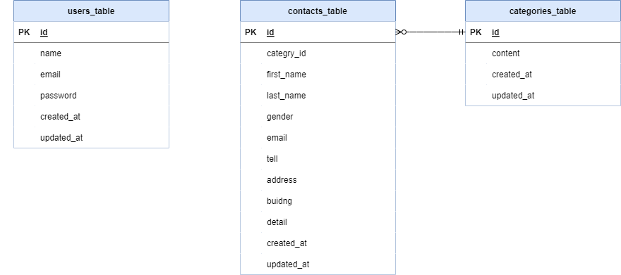

# アプリケーション名　「お問い合わせフォーム」

## 環境構築
[Dockerビルド]
  1. git clone git@github.com:risamatsumoto1104/contact-form.git
  2. docker-compose up -d --build

[Laravel環境構築]
　1. docker-compose exec php bash
  2. composer install
  3. 「.env.example」ファイルをコピーし、「.env」ファイルを作成。「.env」ファイルにて環境変数を変更
  4. php artisan key:generate
  5. php artisan migrate
  6. php artisan db:seed

## 使用技術(実行環境)
・DockerCompose 3.8
・Laravel 8.x
・PHP 7.4.9
・MySQL 8.0.26

## ER図

## URL
・開発環境 : http://localhost/
・phpMyAdmin : http://localhost:8080/
